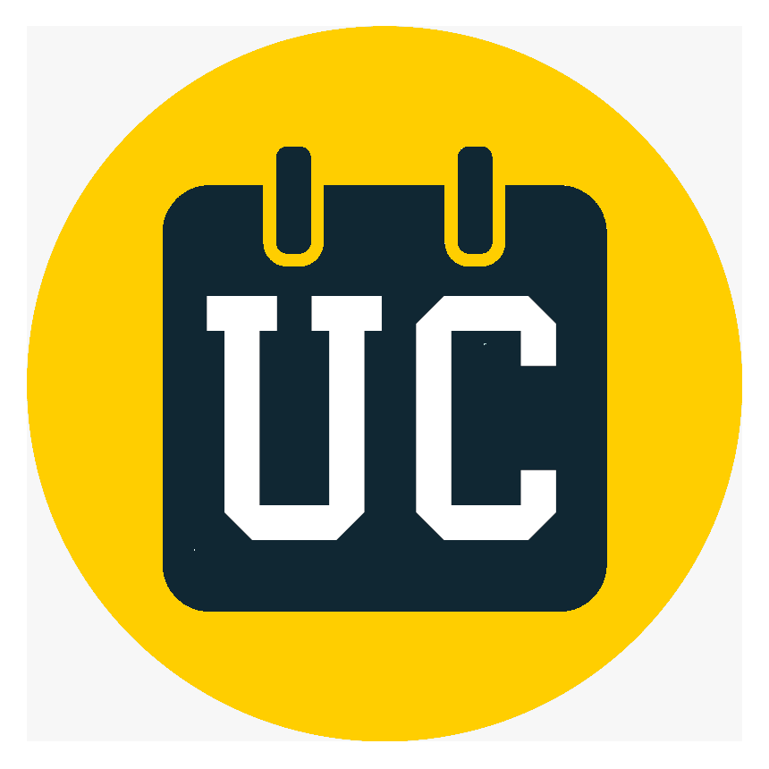
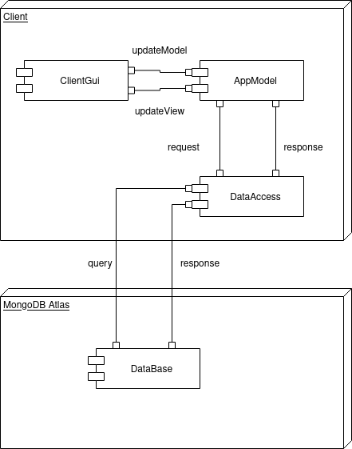
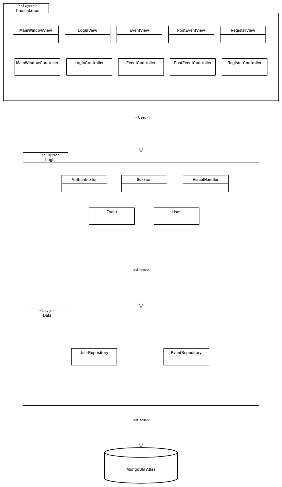
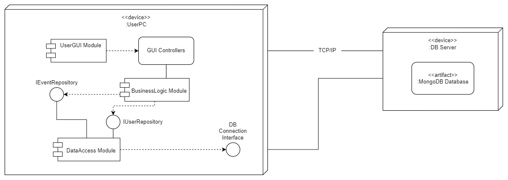
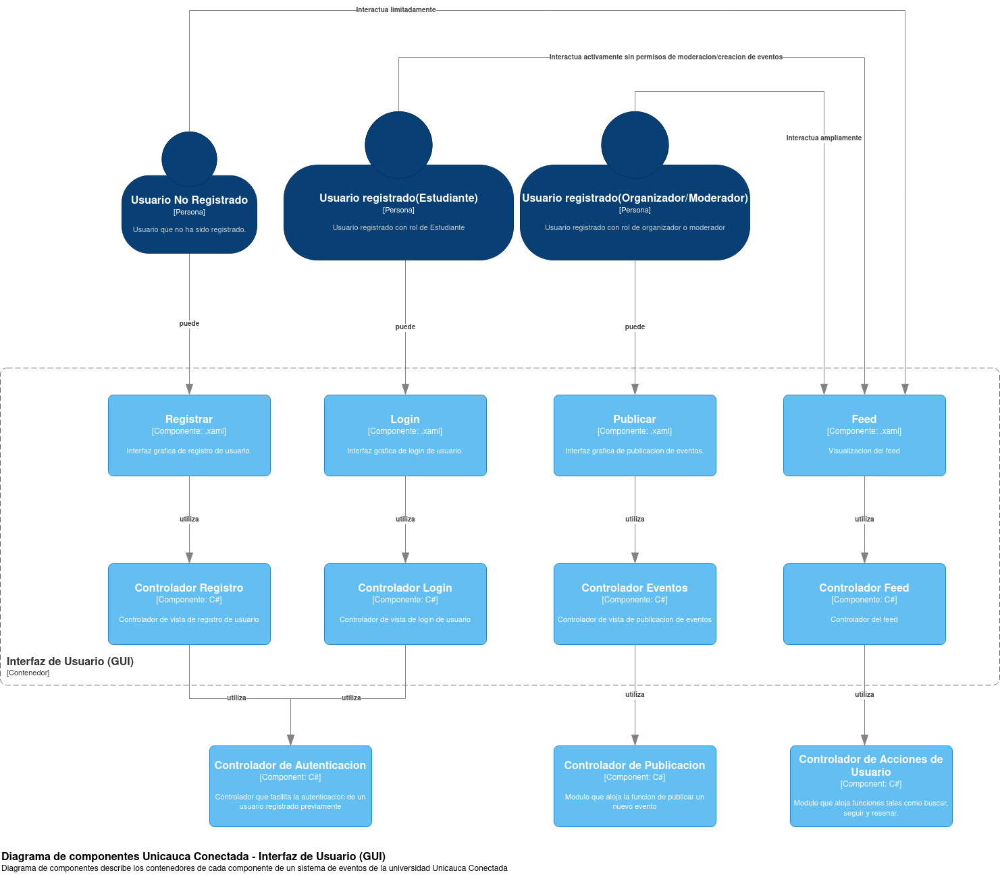
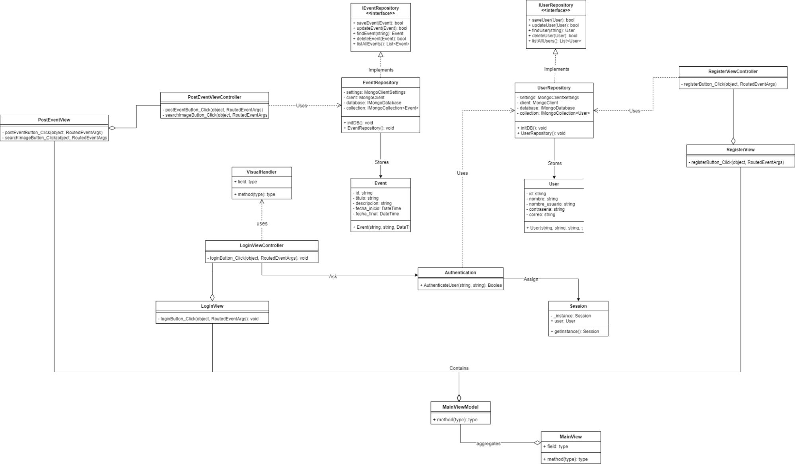

<p align="center">
  
</p>

# Unicauca Conectada

Unicauca Conectada es un proyecto cuyo fin es implementar una aplicación de
escritorio para acceder a todos los eventos en la Universidad. La aplicación
utiliza un enfoque que permite a los usuarios publicar, etiquetar y encontrar
eventos fácilmente, así como seguir a los organizadores de eventos. La
aplicación también proporciona a los organizadores una forma de contactar a los
estudiantes por medio de notificaciones. Se planea seguir un modelo basado en
calificaciones para ayudar a los estudiantes a escoger con mayor fiabilidad qué
eventos pagos le parezcan más relevantes. \
MongoDB Atlas, C#, .NET

# Arquitectura

Se decidió aplicar un diseño arquitectónico por capas por ventajas como:
* Fácil de entender para equipos nuevos en el desarrollo de software.
* Versatilidad a la hora de desarrollar software con cortos plazos de entrega.
* Flexibilidad para realizar mantenimiento.
Adicionalmente, los miembros del equipo tiene algo de experiencia con esta
arquitectura y otras afines tales con MVC.

# Vista de componentes y conectores



# Vista de módulos (UML)



# Vista de instalación (UML)



# Base de datos

El motor de base de datos a utilizar es MondoDB

 

# C4

Se hace uso de modelos C4 para representar la arquitectura de la aplicación en
diferentes niveles de abstracción: 

1. Diagrama de contexto
2. Diagrama de contenedores
3. Diagrama de componentes
    * Interfaz de usuario
    * Backend 

## Diagrama de contexto


## Diagrama de contenedores


## Diagrama de componentes

### Interfaz de usuario



### Backend


# Diagrama de clases



# Flujo de Trabajo Git (Estrategia de Intregracion Continua): 

## Centralized Workflow
Vamos a seguir buenas prácticas para integración continua como [centralized](https://www.atlassian.com/git/tutorials/comparing-workflows#centralized-workflow). 

### 

Para comenzar se debe clonar el proyecto (via HTTPS) con:
```
git clone https://github.com/dohimenezg/UnicaucaConectada.git
```
Luego vamos a seguir el siguiente proceso cada vez que se vayan a subir cambios a rama:

### Subir cambios al repositorio remoto

1. Seleccionar los cambios a guardar
```
git add .
```
2. Guardar los cambios localmente con un commit siendo descriptivo con la tarea/refactor/cambio que se realizo
```
git commit -m "Login Button added to GUI and Login Button Logic implemented"
```
3. Como es un flujo centralizado se deben descargar los cambios de la rama principal antes de subir los propios
```
git pull --rebase origin main
```
4. Subir los cambios a la rama principal
```
git push origin main
```

# Ejecución desde CLI

Para correr el proyecto desde el CLI recordar tener previamente instalado [.NET 6.0](https://dotnet.microsoft.com/en-us/download). \
Entre en la carpeta `EventosVista` y corra el siguiente comando:
```
dotnet run
```

# Equipo de desarrollo

El equipo de desarrollo de Unicauca Conetada esta integrado por:  
- [David Jiménez](https://github.com/dohimenezg)
- [Julian Ordoñez](https://github.com/juleMay)
- [Daniel Pastas](https://github.com/pdaniel102)
