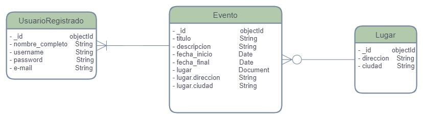
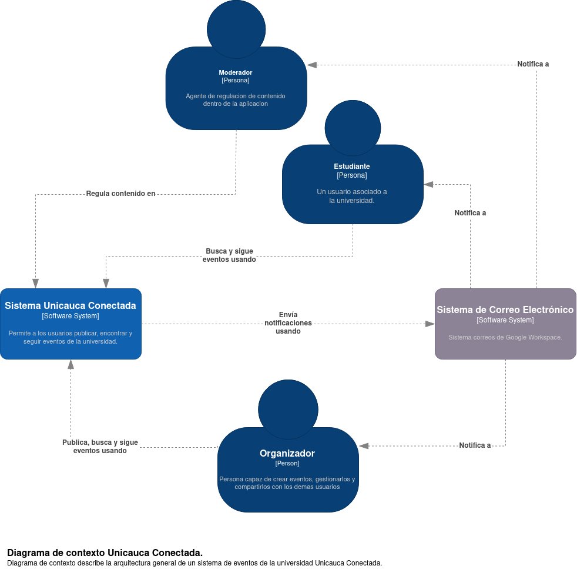

# Unicauca Conectada

Unicauca Conectada es un proyecto cuyo fin es implementar una aplicación de
escritorio para acceder a todos los eventos en la Universidad. La aplicación
utiliza un enfoque que permite a los usuarios publicar, etiquetar y encontrar
eventos fácilmente, así como seguir a los organizadores de eventos. La
aplicación también proporciona a los organizadores una forma de contactar a los
estudiantes por medio de notificaciones. Se planea seguir un modelo basado en
calificaciones para ayudar a los estudiantes a escoger con mayor fiabilidad qué
eventos pagos le parezcan más relevantes.

# Base de datos

El motor de base de datos a utilizar es MondoDB

 

# C4

Se hace uso de modelos C4 para representar la arquitectura de la aplicación en
diferentes niveles de abstracción: 

1. Diagrama de contexto
2. Diagrama de contenedores
3. Diagrama de componentes
    * Interfaz de usuario
    * Backend 

## Diagrama de contexto

## Diagrama de contenedores

## Diagrama de componentes

### Interfaz de usuario

### Backend

# Equipo de desarrollo

El equipo de desarrollo de Unicauca Conetada esta integrado por:  
- [`David Jiménez`](https://github.com/dohimenezg)
- [`Julian Ordoñez`](https://github.com/juleMay)
- [`Daniel Pastas`](https://github.com/pdaniel102)

